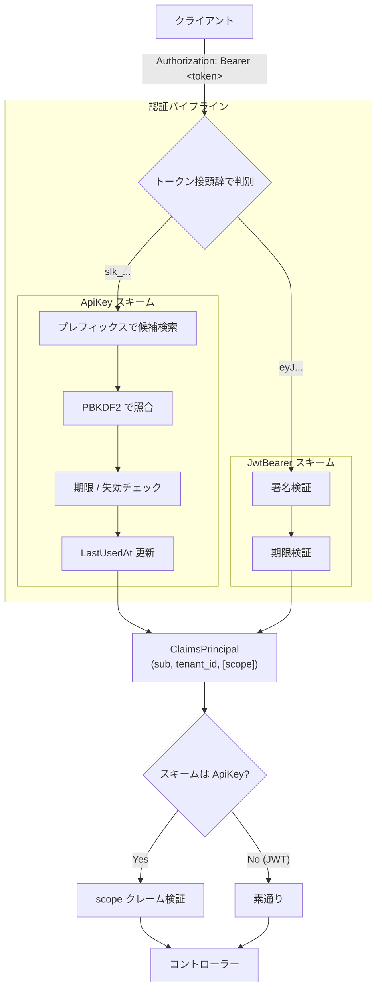

# APIキー認証 設計

## 背景

SELENE は現状 Google / GitHub OAuth + JWT のみで認証している。JWT は短命（アクセストークン 15 分／リフレッシュトークン 7 日）で、ブラウザでの対話的利用に最適化されている。

一方、関連プロジェクト [selene-mcp-server](https://github.com/Riri-Inferno/selene-mcp-server) のように **外部システムやスクリプトから恒久的に API を叩く用途**には、JWT は構造的に合わない。現状の運用ではブラウザでログインして DevTools から JWT を取り出し、環境変数に貼り付けるという手作業が発生しており、PoC を超えた常用には耐えない。

この乖離を埋めるため、JWT とは別のトラックとして **ユーザー単位で発行できる長寿命の API キー**を導入する。

## ゴール

- ユーザーが自分の権限の範囲内で、API キーを **発行・一覧・破棄** できる
- 発行された API キーで JWT と同様に既存 API を呼べる
- 漏洩・流用された場合に被害を局所化できる仕組みを持つ（スコープ、有効期限、個別失効、最終使用日時の追跡）
- 既存の JWT 認証および現行コントローラーへの破壊的変更を最小化する

## 非ゴール

- **書き込み権限を持つキーの UI 発行**: データモデルとしては書き込みスコープを表現可能にするが、初期リリースでは読み取りスコープのみ発行可能とする。
- **エンドポイント単位の細粒度スコープ** (`transactions:read` 等): スコープを文字列セットとして扱う設計にしておくが、初期は `read` / `write` の 2 段階のみ。
- **OAuth クライアント認証ライクなトークン交換フロー**: API キーは長寿命の対称シークレットとして単純に扱う。
- **キーの自動ローテーション**: 手動失効＋再発行で運用する。

## 設計の中核となる決定事項

### 決定 1: JWT とは独立した認証スキームとして実装する

ASP.NET Core の認証は複数の「スキーム」を並列に登録できる。本機能は既存の `JwtBearer` スキームに手を入れず、`ApiKey` という新規スキームを追加する。

**理由:**

- JWT 用のミドルウェアと同居させると、検証ロジック（署名検証 vs ハッシュ照合）の混在で複雑度が上がる
- 既存の JWT 専用エンドポイントは何もせずそのまま動く（明示的に許可しない限り API キーでは叩けない）
- スキームを分けることで、認可ポリシー側で「キーで来たときだけスコープを要求し、JWT は素通り」という分岐が表現しやすい

### 決定 2: API キーは `Authorization: Bearer` ヘッダで送る

`X-Api-Key` のような独自ヘッダを使わず、JWT と同じ `Authorization: Bearer <token>` で受ける。スキームの判別はトークン本体の接頭辞で行う（JWT は `eyJ`、API キーは `slk_`）。

**理由:**

- 既存クライアント（フロントエンド axios、MCP サーバ、curl）の HTTP コードを変えなくて済む
- 接頭辞による判別は決定的かつ衝突しない（JWT は base64url の RFC 構造上 `slk_` 始まりにならない）
- 「Bearer は JWT 専用」とする規約上の縛りは特にないため、デメリットは小さい

### 決定 3: キー本体は PBKDF2 ハッシュで保存し、プレフィックスのみ平文保存する

DB に保存するのはハッシュ済みのキーと、UI 一覧・認証時の候補絞り込み用の先頭数文字（プレフィックス）のみ。

**理由:**

- 漏洩耐性: DB が抜かれてもキーそのものは復元不可（既存 `IPasswordHashService` (PBKDF2) を流用）
- 識別性: UI で「どのキーか」を見せるためには平文の手がかりが必要。先頭 8〜12 文字を残しておけば識別と簡易検索に十分
- 認証性能: プレフィックスを WHERE 条件に使えば、ハッシュ照合の候補は通常 1 件か数件に絞れる

### 決定 4: スコープは文字列セットとして保存し、初期は `read` / `write` の 2 段階

DB 上のカラムはスペース区切りの文字列で持つ。初期発行可能スコープは `read` のみ。

**理由:**

- 「ユーザー数 × 命名規則」で固定列を生やすより、将来 `transactions:write` のような細粒度を追加するときの DDL が不要
- 2 段階で始める方針は、現時点で書き込みを LLM/外部ツール経由で許す具体要件がないため。スキーマ拡張性だけ確保しておく

### 決定 5: 有効期限は発行時に任意で指定可能（NULL = 無期限）

ユーザーが発行画面で日付を選択するか、「無期限」を選ぶ。

**理由:**

- 有限期限はセキュリティ上望ましいが、機械間通信では「気づかぬうちに切れて止まる」事故を引き起こす
- このアプリは個人〜家庭規模のドメインであり、ユーザー自身が責任を取れる範囲。**強制よりも明示的な選択肢**として提示するほうが運用と整合する
- 一方、企業向け／マルチテナント向けにスケールする場合は最大期限を強制するポリシーを後から追加可能

## アーキテクチャ概観



認証パイプラインで生成された `ClaimsPrincipal` の中身は、JWT 経由でも API キー経由でも実質的に同じ（`sub` = UserId, `tenant_id` = TenantId）。違いはスキーム名と `scope` クレームの有無のみ。これにより、コントローラー側のビジネスロジックは認証手段の差異を意識しなくて良い。

## データモデル

新規エンティティ `ApiKeyEntity`（`BaseEntity` を継承し、xmin・IsDeleted・TenantId は既存ルールに準拠）。

| フィールド | 型 | NULL | 役割 |
|---|---|---|---|
| `UserId` | `Guid` | 不可 | 紐づくユーザー（FK to Users, Cascade） |
| `Name` | `string(100)` | 不可 | ユーザーが付けるラベル（例: "MCP - 自宅PC"） |
| `KeyPrefix` | `string(16)` | 不可 | 認証時の候補絞り込みと UI 識別に使用。平文 |
| `KeyHash` | `string(100)` | 不可 | キー本体の PBKDF2 ハッシュ |
| `Scopes` | `string(256)` | 不可 | スペース区切りスコープ集合（例: `"read"`） |
| `ExpiresAt` | `DateTimeOffset?` | 可 | NULL = 無期限 |
| `LastUsedAt` | `DateTimeOffset?` | 可 | 認証成功時に更新 |
| `RevokedAt` | `DateTimeOffset?` | 可 | NULL でなければ拒否 |

インデックス: `(UserId)`、`(KeyPrefix)`。

### キーの文字列形式

```
slk_<base64url(random32bytes)>
```

`slk_` は **S**ELENE **L**ong-lived **K**ey の意味で、視認性とスキーム判別の両方に寄与する。本体 32 バイト（256 bit）の暗号論的乱数を `RandomNumberGenerator` で生成し base64url エンコードする。平文がクライアントに渡るのは **発行時の応答 1 回限り** で、以降は DB 上のハッシュからは復元不能。

## 認可モデル

スコープは `read` / `write` の 2 段階。認可は `Policy` レイヤで表現する。

- `ApiKey.Read` ポリシー: スキームが `ApiKey` のときに限り、`scope` クレームに `read` を含むことを要求。JWT で来た場合は素通り。
- `ApiKey.Write` ポリシー: 同様に `write` を要求。JWT は素通り。

「JWT のときは素通り」とすることで、人間ユーザー（ブラウザ）の操作は JWT さえあれば全機能を使え、書き込み権限のない API キーが意図せず書き込みエンドポイントを叩いてしまう経路を構造的に塞ぐ。

コントローラー側は、「API キーでも叩けるエンドポイント」に対してのみ `AuthenticationSchemes` に `ApiKey` を含めることでオプトインする。**既存エンドポイントは何もしなければ JWT 専用**として動き続けるため、開放を一括ではなく段階的に進められる。

## キーのライフサイクル

### 発行

JWT 認証下でユーザーが「名前」「スコープ（当面 `read` 固定）」「有効期限 or 無期限」を指定して発行を要求する。サーバは乱数生成 → ハッシュ化 → DB 永続化 → 平文を 1 回だけレスポンスに含めて返す。UI は「**この後は二度と表示できません**」を明示してユーザーにコピーを促す。

### 使用

クライアントは受け取った平文キーを保存し、以降の API 呼び出しの `Authorization: Bearer` ヘッダに乗せる。サーバは認証ハンドラ内でプレフィックス検索 → ハッシュ照合 → 期限・失効チェックを行い、成功時に `LastUsedAt` を更新する。

### 失効

UI からユーザーが個別のキーに対して失効操作を行うと `RevokedAt` が立つ。物理削除はしない（監査・誤操作復旧の余地を残す）。失効済みキーでの認証要求は 401 を返す。

### 期限切れ

`ExpiresAt < now()` のキーは認証時点で拒否される。物理削除も同時には行わない。ためたままにすると `RefreshToken` と同じ要領で蓄積するため、別タスクで定期クリーンアップを検討する。

## 既存 JWT 認証との共存

- デフォルト認証スキームは `JwtBearer` のまま据え置く
- 既存の `[Authorize]` だけが付いたエンドポイントは挙動に変化なし（API キーでは認証されない）
- API キーを許容したいエンドポイントだけ、属性側で複数スキームを許可する
- フロントエンド axios は既存の通り JWT を `Authorization: Bearer` で送るので、フロントの実装にも変更は要らない

この設計の帰結として、「API キーで使える API は明示的に開放されたものだけ」という安全側のデフォルトを保てる。

## 脅威モデルと対策

| 脅威 | 対策 |
|---|---|
| DB 漏洩によるキー復元 | PBKDF2 ハッシュ保存。プレフィックスのみ平文 |
| キーの流出 | UI から即時失効 (`RevokedAt`)。プレフィックスで「どれが流出したか」を識別可能にする |
| 流出キーによる書き込み | スコープ `read` のキーは認可レイヤで `write` 系エンドポイントから弾かれる |
| 流出キーで全エンドポイントを叩かれる | 「明示開放した API のみ通る」設計で攻撃面を最小化 |
| 通信経路での盗聴 | HTTPS 必須（既存ポリシー） |
| ブルートフォース | 本体 256 bit の乱数 + PBKDF2 で計算量上困難。レート制限は将来検討 |
| ログ経由のキー漏れ | リクエストロガーで `Authorization` ヘッダをマスクすることを実装フェーズで担保 |
| 期限切れに気づかず通信が止まる | 「無期限」を選択肢として提示する。期限ありを選んだ場合の事前通知は将来 |

## エラーモデル

認証段階で以下の条件を一つでも満たすキーは 401 として拒否する。

- 該当する `KeyHash` を持つレコードが存在しない
- `RevokedAt` が NULL でない
- `ExpiresAt` が現在時刻より過去
- `IsDeleted = true`

認証は成功したがスコープ要件を満たさない場合は 403 を返す（読み取り専用キーで `write` エンドポイントを叩いた場合など）。

## 制約と将来拡張

本設計の初期リリースに含めず、必要が見えた時点で別タスク化する事項：

- 書き込みスコープを発行可能にする UI と認可拡張
- エンドポイント単位の細粒度スコープ
- キー単位のレート制限
- 期限切れ・失効済みキーの定期物理削除
- 直近の使用履歴ダッシュボード（IP、UA、呼び出し回数）
- 期限の事前通知（メール／アプリ内通知）

データモデル側はこれらを後から差し込める形に作っておく（スコープは文字列セット、`LastUsedAt` 単体ではなく履歴テーブルへの拡張余地、など）。

## 関連ドキュメント

- [認証フロー（既存）](../Architecture/auth-flow.md)
- [認証API仕様（既存）](../API/authentication.md)
- [selene-mcp-server (利用側プロジェクト)](https://github.com/Riri-Inferno/selene-mcp-server)
