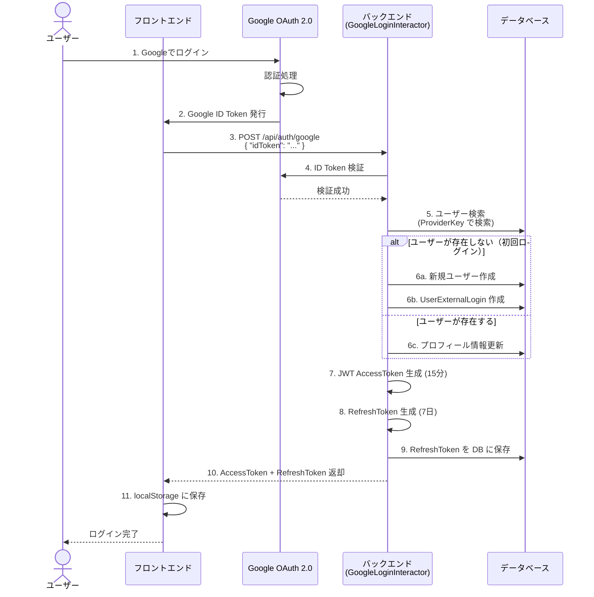
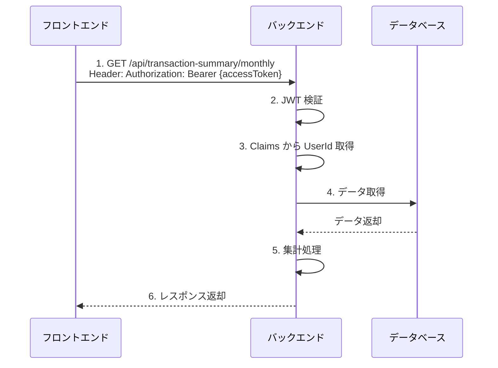
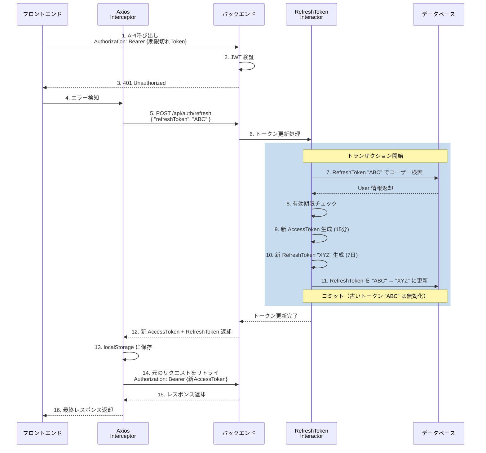
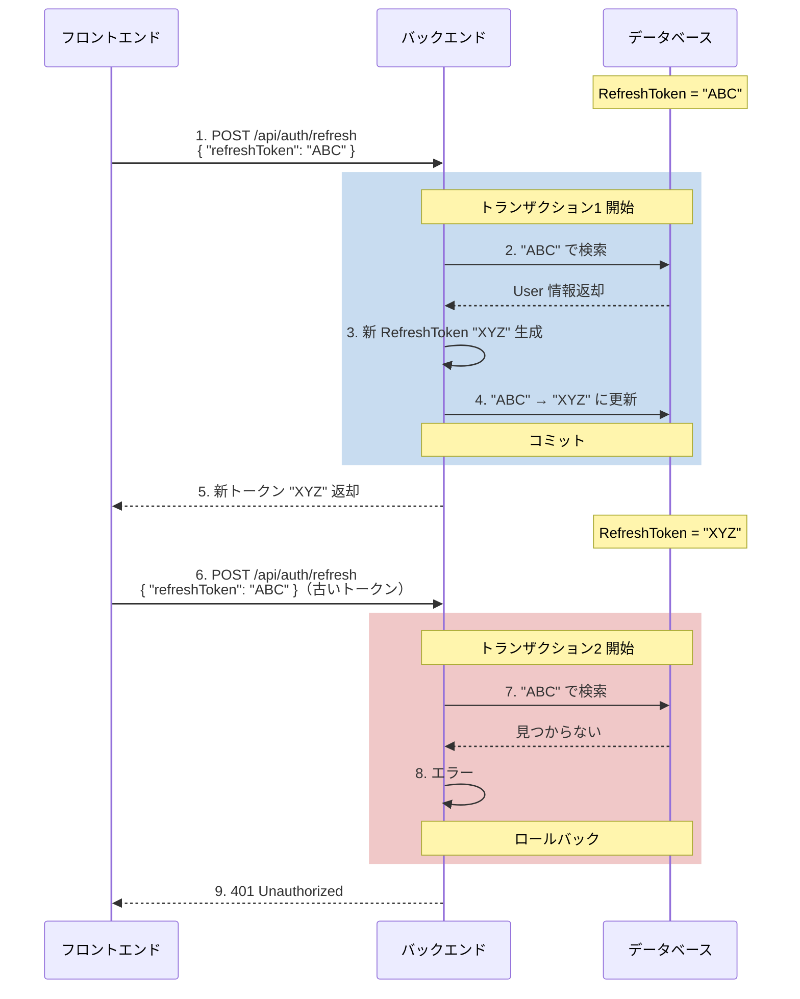
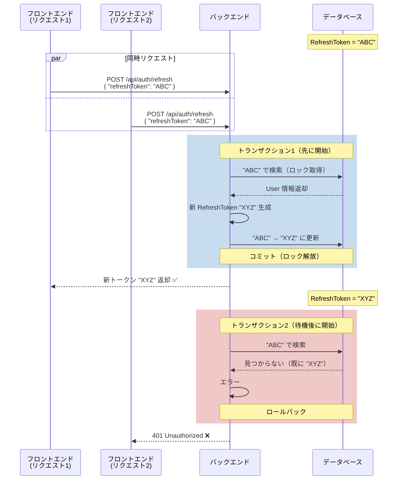
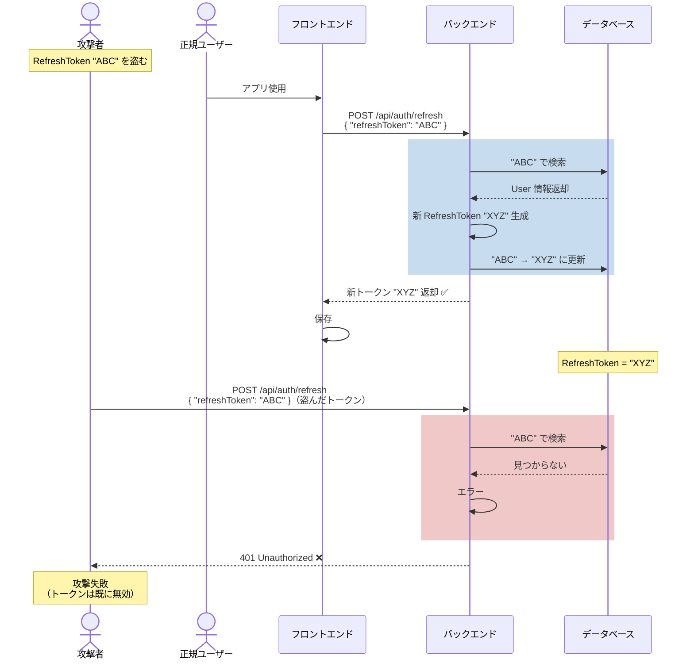
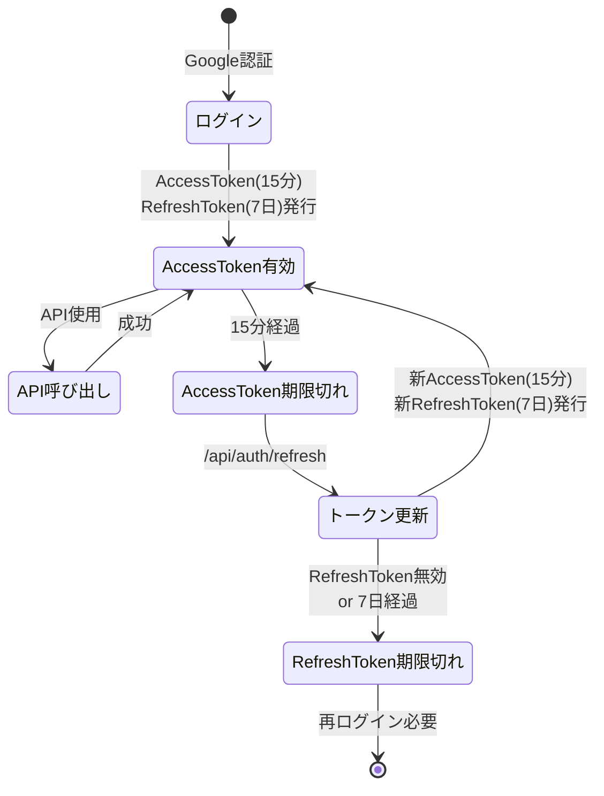

# 認証フロー

このドキュメントでは、本システムの認証フローを詳細に説明します。

---

## 目次

1. [全体フロー（初回ログイン）](#1-全体フロー初回ログイン)
2. [通常のAPI呼び出しフロー](#2-通常のapi呼び出しフロー)
3. [トークン更新フロー（AccessToken 期限切れ時）](#3-トークン更新フローaccesstoken-期限切れ時)
4. [One-Time Use の動作](#4-one-time-use-の動作)
5. [セキュリティ上の脅威と対策](#5-セキュリティ上の脅威と対策)
6. [トークンのライフサイクル](#6-トークンのライフサイクル)
7. [データベース設計](#7-データベース設計)
8. [設定値](#8-設定値)

---

## 1. 全体フロー（初回ログイン）



### フローの説明

1. ユーザーが Google ログインボタンをクリック
2. Google OAuth 2.0 の認証画面が表示され、ユーザーが認証
3. Google から **ID Token** が発行される
4. フロントエンドが ID Token をバックエンドに送信
5. バックエンドが Google API で ID Token を検証
6. ユーザーの存在確認：
   - **初回ログイン**: 新規ユーザーと外部ログイン情報を作成
   - **既存ユーザー**: プロフィール情報（名前、メールアドレス、プロフィール画像）を更新
7. JWT AccessToken（有効期限15分）を生成
8. RefreshToken（有効期限7日）を生成
9. RefreshToken を DB に保存
10. 両方のトークンをフロントエンドに返却
11. フロントエンドが localStorage に保存

---

## 2. 通常のAPI呼び出しフロー



### フローの説明

1. フロントエンドが API を呼び出し（Authorization ヘッダーに AccessToken を付与）
2. バックエンドが JWT の署名を検証
3. JWT の Claims（ペイロード）から UserId、Email、TenantId などを取得
4. データベースからデータを取得
5. ビジネスロジックを実行（例：月次サマリーの集計）
6. レスポンスを返却

### JWT の Claims 例

```json
{
  "sub": "aaa88a5c-113d-4740-9e59-1a9789fdf146",
  "email": "riri-inferno@gmail.com",
  "name": "りり",
  "tenant_id": "deadeade-0001-0000-0000-000000000001",
  "jti": "2eebdcd8-14e3-44a5-ad43-05ba512ca6aa",
  "exp": 1768647632,
  "iss": "ServerlessKakeiboApi",
  "aud": "ServerlessKakeiboApp"
}
```

---

## 3. トークン更新フロー（AccessToken 期限切れ時）



### フローの説明

1. フロントエンドが API を呼び出すが、AccessToken が期限切れ
2. バックエンドが JWT 検証に失敗
3. 401 Unauthorized を返却
4. Axios Interceptor がエラーを検知
5. 自動的に `/api/auth/refresh` を呼び出し
6. RefreshTokenInteractor が処理開始
7. **トランザクション内で** RefreshToken でユーザーを検索
8. RefreshToken の有効期限（7日）をチェック
9. 新しい AccessToken（有効期限15分）を生成
10. 新しい RefreshToken（有効期限7日）を生成
11. DB の RefreshToken を更新（古いトークンは無効化）
12. 新しいトークンペアを返却
13. localStorage に保存
14. 元のリクエストを新しい AccessToken で再実行
15. レスポンス取得
16. フロントエンドに返却（ユーザーはトークン更新を意識しない）

### 重要な仕様

- ✅ **トランザクション保護**: 検索から更新までが1つのトランザクション
- ✅ **One-Time Use**: 古い RefreshToken は1回使用したら無効化
- ✅ **自動リトライ**: Axios Interceptor により、ユーザーは再ログイン不要

---

## 4. One-Time Use の動作

### 4-1. 正常系（連続使用）



#### 説明

**時刻 t=0**:
- DB: `RefreshToken = "ABC"`

**リクエスト1 (t=0)**:
- "ABC" で検索 → ヒット
- 新トークン "XYZ" 生成
- DB更新: "ABC" → "XYZ"
- コミット
- **結果**: ✅ 成功（新トークン "XYZ" 返却）

**時刻 t=1**:
- DB: `RefreshToken = "XYZ"`

**リクエスト2 (t=1)**:
- "ABC" で検索 → 見つからない（既に "XYZ" に更新済み）
- エラー
- **結果**: ❌ 失敗（401 Unauthorized）

---

### 4-2. 連打（同時リクエスト）



#### 説明

**時刻 t=0**:
- DB: `RefreshToken = "ABC"`

**リクエスト1 と リクエスト2 が同時発生 (t=0)**:

**トランザクション1（先に開始）**:
- "ABC" で検索 → ヒット（行ロック取得）
- 新トークン "XYZ" 生成
- DB更新: "ABC" → "XYZ"
- コミット（ロック解放）
- **結果**: ✅ 成功

**トランザクション2（待機中）**:
- トランザクション1のコミット後に検索開始
- "ABC" で検索 → 見つからない（既に "XYZ" に更新済み）
- エラー
- **結果**: ❌ 失敗（401 Unauthorized）

#### 重要な仕組み

- **PostgreSQL のトランザクション分離レベル（Read Committed）**により、2つ目のリクエストは1つ目のコミット後に検索する
- **行ロック**により、同時更新が防止される
- 必ず**1つだけ成功**し、残りは失敗する

---

## 5. セキュリティ上の脅威と対策

### 5-1. RefreshToken の盗難



#### 対策の有効性: ✅ 高い

**メカニズム**:
- One-Time Use により、盗まれたトークンは1回しか使えない
- 正規ユーザーが先に使用すれば攻撃者はブロックされる

**シナリオ**:
1. 攻撃者が RefreshToken "ABC" を盗む
2. 正規ユーザーが "ABC" で更新 → 成功（新トークン "XYZ" 取得）
3. 攻撃者が "ABC" で更新を試みる → ❌ 失敗（既に無効）
4. 攻撃者はアクセスできない

---

### 5-2. AccessToken の盗難

#### 脅威シナリオ

```
攻撃者が AccessToken を盗む
  ↓
15分以内なら攻撃者もAPI呼び出し可能
  ↓
15分後に自動的に無効化
```

#### 対策の有効性: ⚠️ 中程度

**メカニズム**:
- 短命（15分）により被害を最小化
- より短くする（5分など）ことも可能だが、UX が悪化

**トレードオフ**:
- 短い有効期限 → セキュリティ向上、但し頻繁なリフレッシュで UX 低下
- 長い有効期限 → UX 向上、但しセキュリティリスク増大

---

### 5-3. XSS攻撃による localStorage からのトークン盗難

#### 脅威シナリオ

```
悪意のあるスクリプトがページに埋め込まれる
  ↓
localStorage からトークンを読み取る
  ↓
外部サーバーに送信
```

#### 対策の有効性: ❌ 低い

**問題点**:
- localStorage は JavaScript からアクセス可能
- XSS 攻撃に脆弱

**推奨される追加対策**:

1. **Content Security Policy (CSP) の設定**
   ```html
   <meta http-equiv="Content-Security-Policy" 
         content="default-src 'self'; script-src 'self'">
   ```

2. **httpOnly Cookie の使用**
   - JavaScript からアクセス不可（XSS から保護）
   - ただし、CSRF 対策が必要

3. **SameSite Cookie 属性の設定**
   ```
   Set-Cookie: refreshToken=...; HttpOnly; Secure; SameSite=Strict
   ```

---

## 6. トークンのライフサイクル



### タイムライン

```
ログイン
  ↓
AccessToken (有効期限: 15分)
RefreshToken (有効期限: 7日)
  ↓
  ├─ 0-15分: AccessToken で API 呼び出し
  │
  ├─ 15分後: AccessToken 期限切れ
  │   └─ 自動的に RefreshToken で更新
  │      └─ 新 AccessToken (有効期限: 15分)
  │         新 RefreshToken (有効期限: 7日)
  │
  ├─ 以降、上記を繰り返し
  │
  └─ 7日後: RefreshToken も期限切れ
      └─ 再ログインが必要
```

---

## 7. データベース設計

### Users テーブル

| カラム | 型 | NULL | 説明 |
|--------|----|----|------|
| Id | UUID | NOT NULL | ユーザーID（PK） |
| DisplayName | VARCHAR(100) | NOT NULL | 表示名 |
| Email | VARCHAR(256) | NULL | メールアドレス |
| PictureUrl | VARCHAR(500) | NULL | プロフィール画像URL |
| **RefreshToken** | VARCHAR(500) | NULL | **リフレッシュトークン** |
| **RefreshTokenExpiry** | TIMESTAMPTZ | NULL | **リフレッシュトークン有効期限** |
| TenantId | UUID | NOT NULL | テナントID |
| CreatedAt | TIMESTAMPTZ | NOT NULL | 作成日時 |
| UpdatedAt | TIMESTAMPTZ | NOT NULL | 更新日時 |
| CreatedBy | UUID | NOT NULL | 作成者ID |
| UpdatedBy | UUID | NOT NULL | 更新者ID |
| IsDeleted | BOOLEAN | NOT NULL | 削除フラグ（Default: false） |

**インデックス**:
- PRIMARY KEY: `Id`
- UNIQUE INDEX: `Email` (WHERE IsDeleted = false)
- INDEX: `TenantId`
- INDEX: `RefreshToken` （検索パフォーマンス向上のため推奨）

---

### UserExternalLogins テーブル

| カラム | 型 | NULL | 説明 |
|--------|----|----|------|
| Id | UUID | NOT NULL | ID（PK） |
| UserId | UUID | NOT NULL | ユーザーID（FK） |
| ProviderName | VARCHAR(50) | NOT NULL | プロバイダー名（例: "Google"） |
| ProviderKey | VARCHAR(128) | NOT NULL | プロバイダー側のユーザーID |
| TenantId | UUID | NOT NULL | テナントID |
| CreatedAt | TIMESTAMPTZ | NOT NULL | 作成日時 |
| UpdatedAt | TIMESTAMPTZ | NOT NULL | 更新日時 |
| CreatedBy | UUID | NOT NULL | 作成者ID |
| UpdatedBy | UUID | NOT NULL | 更新者ID |
| IsDeleted | BOOLEAN | NOT NULL | 削除フラグ |

**インデックス**:
- PRIMARY KEY: `Id`
- UNIQUE INDEX: `(ProviderName, ProviderKey)` (WHERE IsDeleted = false)
- INDEX: `UserId`

**外部キー**:
- `UserId` → `Users.Id` (ON DELETE CASCADE)

---

## 8. 設定値

### appsettings.json

```json
{
  "Authentication": {
    "Google": {
      "ClientId": ""
    },
    "Jwt": {
      "SecretKey": "your-secret-key-at-least-32-characters-long",
      "Issuer": "ServerlessKakeiboApi",
      "Audience": "ServerlessKakeiboApp",
      "ExpirationMinutes": "15",
      "RefreshTokenExpirationDays": "7"
    }
  }
}
```

### 本番環境での注意事項

⚠️ **Secキュリティ上の警告**:

1. **SecretKey の管理**
   - 環境変数や Azure Key Vault、AWS Secrets Manager などで管理してください
   - GitHub などのリポジトリに**絶対に**コミットしないでください
   - 最低32文字以上の複雑な文字列を使用してください

2. **Google ClientId**
   - 開発環境と本番環境で別々の ClientId を使用してください
   - Google Cloud Console で適切なリダイレクトURIを設定してください

3. **HTTPS の使用**
   - 本番環境では必ず HTTPS を使用してください
   - トークンの盗聴を防止するために必須です

---

## 関連ドキュメント

- [認証API仕様](../API/authentication.md)
